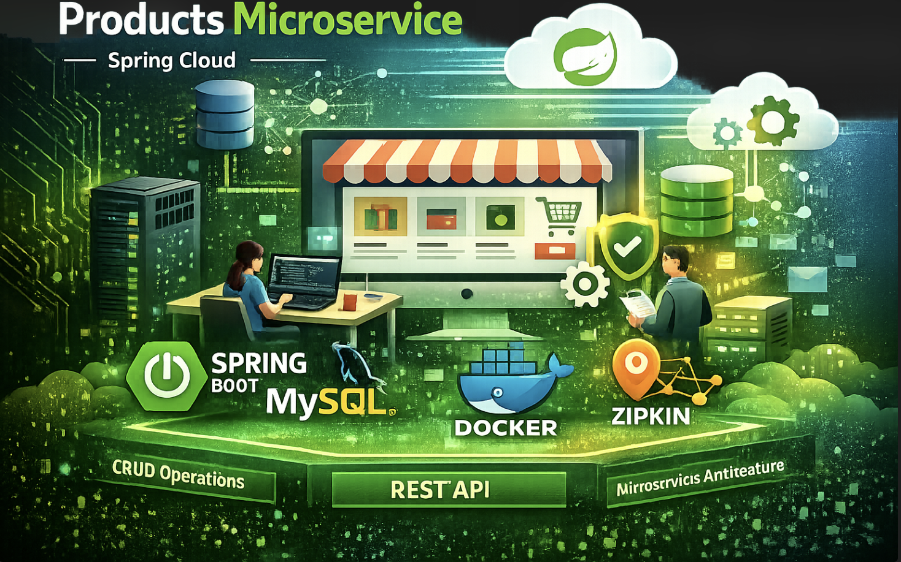

# Tickets Microservice - Spring Boot

## 📌 Descripción

Este proyecto es un microservicio backend desarrollado con **Spring Boot**, orientado a la gestión de **tickets**. Implementa una arquitectura por capas (Controller → Service → Repository), utilizando **DTOs**, manejo de **excepciones** y una capa de **seguridad** basada en filtros.

---

## 🧱 Estructura del Proyecto

```css
.
├── .idea/                         # Configuración de IntelliJ (opcional)
├── .mvn/                          # Maven Wrapper
│   └── wrapper/
├── pom.xml                        # Dependencias y configuración Maven (si aplica)
├── src/
│   ├── main/
│   │   ├── java/com/backend/springboot/tickets
│   │   │   ├── config/             # Configuraciones (beans, CORS, etc.)
│   │   │   ├── controller/         # Controladores REST
│   │   │   ├── dto/                # Objetos de transferencia de datos
│   │   │   │   ├── input/          # DTOs de entrada (requests)
│   │   │   │   └── output/         # DTOs de salida (responses)
│   │   │   ├── entity/             # Entidades (modelos JPA)
│   │   │   ├── exception/          # Manejo global de errores / excepciones
│   │   │   ├── repository/         # Acceso a datos (Spring Data)
│   │   │   ├── security/           # Config de seguridad
│   │   │   │   └── filter/         # Filtros (JWT / auth, etc.)
│   │   │   └── service/            # Lógica de negocio
│   │   │       └── imp/            # Implementaciones de servicios
│   │   └── resources/              # application.properties/yml, static, etc.
│   └── test/java/com/backend/springboot/tickets
│       └── ...                     # Tests
└── target/                          # Salida de build (generado por Maven)
```

---

## ⚙️ Tecnologías Usadas

* **Java** (versión según tu entorno)
* **Spring Boot**
* **Spring Web**
* **Spring Data JPA** (si aplica)
* **Spring Security** (capa `security/` y filtros)
* **Maven** (Wrapper incluido)
* **JUnit 5** (tests)

---

## 🗄️ Configuración (BD y propiedades)

Los archivos de configuración se encuentran en:

```text
src/main/resources/
```

Normalmente aquí tendrás `application.properties` o `application.yml` con:

* conexión a base de datos
* puerto
* variables de seguridad (JWT, etc.)
* configuración de logs

> Si me pegas tu `application.properties/yml`, lo agrego documentado con ejemplos.

---

## 🚀 Cómo Ejecutar el Proyecto

### Pre-requisitos

* Java (JDK)
* Maven (opcional, porque ya tienes Maven Wrapper)

### Ejecutar con Maven Wrapper

```bash
./mvnw spring-boot:run
```

En Windows (PowerShell):

```powershell
./mvnw spring-boot:run
```

---

## 📦 Build

```bash
./mvnw clean package
```

El artefacto se genera en `target/`.

---

## 💪 Tests

Ruta de tests:

```text
src/test/java/com/backend/springboot/tickets/
```

Ejecutar:

```bash
./mvnw test
```

---

## 📁 Rutas de Interés

Base URL:

* Developers: `/api/v1/developers`
* Tickets: `/api/v1/tickets`

### 👨‍💻 DeveloperController

| Método | Ruta                          | Descripción                                           |
| -----: | ----------------------------- | ----------------------------------------------------- |
|    GET | `/api/v1/developers`          | Listar developers                                     |
|   POST | `/api/v1/developers`          | Crear developer (**requiere DTO + validación**)       |
|   POST | `/api/v1/developers/register` | Registrar developer como **no-admin** (`admin=false`) |
|    GET | `/api/v1/developers/{id}`     | Obtener developer por ID                              |
|    PUT | `/api/v1/developers/{id}`     | Actualizar developer por ID                           |
| DELETE | `/api/v1/developers/{id}`     | Eliminar developer por ID                             |

Notas:

* Tiene `@CrossOrigin(originPatterns = "*")` (permite CORS desde cualquier origen).
* En `POST /register` se fuerza `admin=false` antes de crear.

### 🎫 TicketController

| Método | Ruta                                                        | Descripción                      |
| -----: | ----------------------------------------------------------- | -------------------------------- |
|    GET | `/api/v1/tickets`                                           | Listar tickets                   |
|   POST | `/api/v1/tickets`                                           | Crear ticket                     |
|    GET | `/api/v1/tickets/{id}`                                      | Obtener ticket por ID            |
|    PUT | `/api/v1/tickets/{id}`                                      | Actualizar ticket por ID         |
| DELETE | `/api/v1/tickets/{id}`                                      | Eliminar ticket por ID           |
|   POST | `/api/v1/tickets/assign/{ticketId}/developer/{developerId}` | Asignar un developer a un ticket |

Notas:

* Este controller retorna directamente la entidad `Ticket` (no DTO). Si quieres un API más consistente, puedes migrar a DTOs como en `DeveloperController`.

---

## 🛠️ Manejo de Errores

La carpeta `exception/` contiene las excepciones personalizadas y (si aplica) un manejador global tipo `@ControllerAdvice` para responder con:

* códigos HTTP correctos (400/404/409/500)
* mensajes consistentes
* payload de error estándar

---

## 📄 Licencia

Este proyecto puede ser distribuido bajo licencia **MIT** (si corresponde). Agrega un archivo `LICENSE` en la raíz si deseas publicarlo.

---

## 📬 Contacto

Para dudas, sugerencias o contribuciones:

📧 [**casseli.layza@gmail.com**](mailto:casseli.layza@gmail.com)

🔗 [LinkedIn](https://www.linkedin.com/in/casseli-layza/) 🔗 [GitHub](https://github.com/CasseliLayza)

💡 **Desarrollado por Casseli Layza como parte de un curso/proyecto con Spring Boot.**

***💚 ¡Gracias por revisar este proyecto!... Powered by Casse 🌟📚🚀...!!***

## Derechos Reservados

```markdown
© 2026 Casse. Todos los derechos reservados.
```
